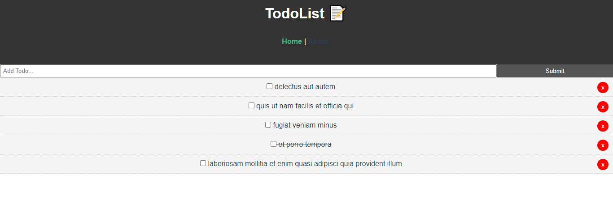

# todo_vue_app 📓

[](https://app.netlify.com/sites/vuetodo-app/deploys) 

A single page TodoList App made in Vue.js.



Don't mind the lorem ipsum text...

### Prerequisites

What things you need to install the software and how to install them

```
* npm 6.15.4 or latest
* Node.js 12.18.0 or latest
```

## Project setup

A step by step series of examples that tell you how to get a development env running

Open Terminal / Command Prompt and type:

```
git clone https://github.com/vamuigua/todo_vue_app.git
```

Then change your directory to the project you have cloned

```
cd todo_vue_app
```

### Install npm packages

```
npm install
```

### Compiles and hot-reloads for development

```
npm run serve
```

### Open application in Browser

```
http://localhost:8000
```

Your done...The app should now be running on your browser 👍

### Compiles and minifies for production

```
npm run build
```

### Lints and fixes files

```
npm run lint
```

### Customize configuration

See [Configuration Reference](https://cli.vuejs.org/config/).

## Built With

- Vue.js

## Authors

- **Victor Allen** - [vamuigua](https://github.com/vamuigua) :v:

## Acknowledgments

- **Brad Traversy** - [bradtraversy](https://github.com/bradtraversy)
